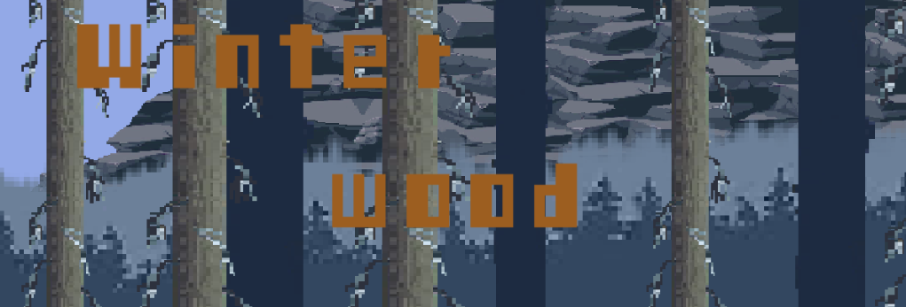
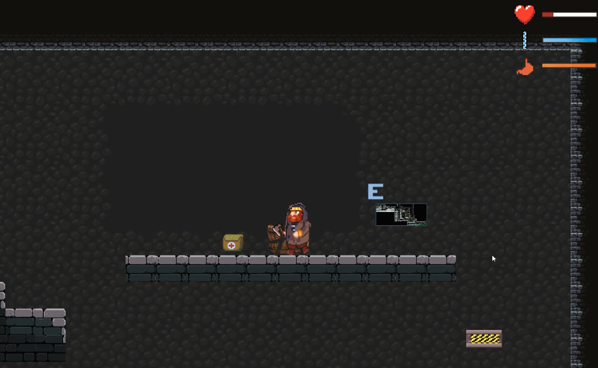
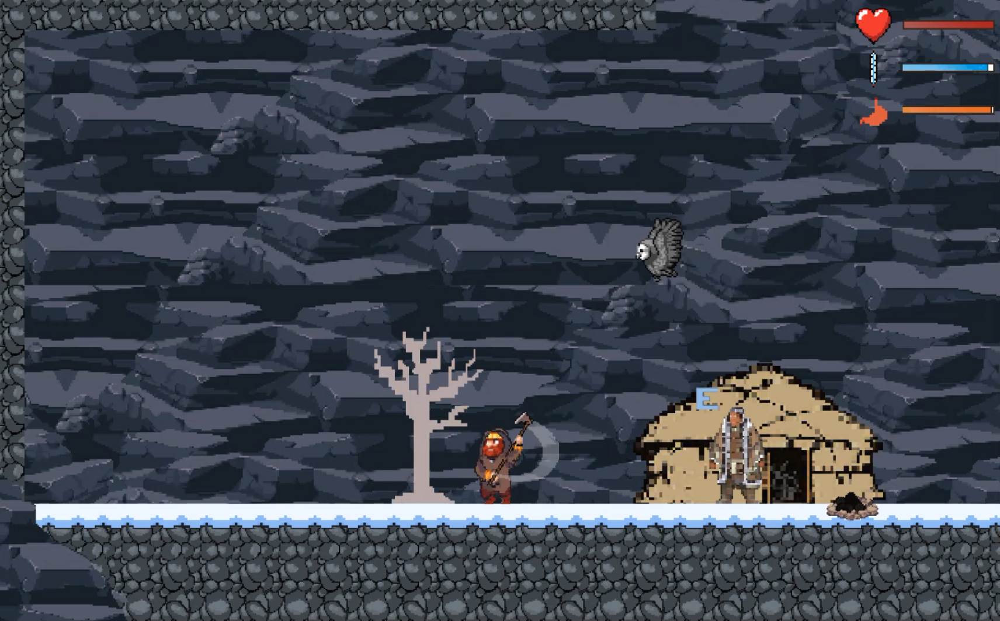
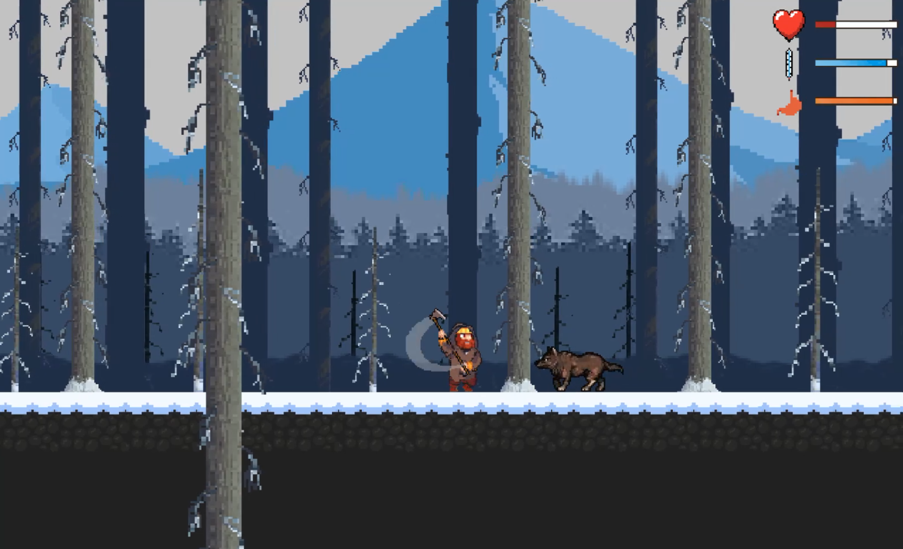
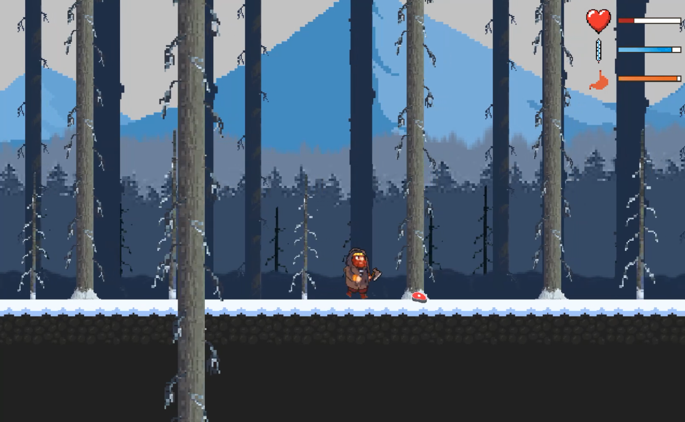
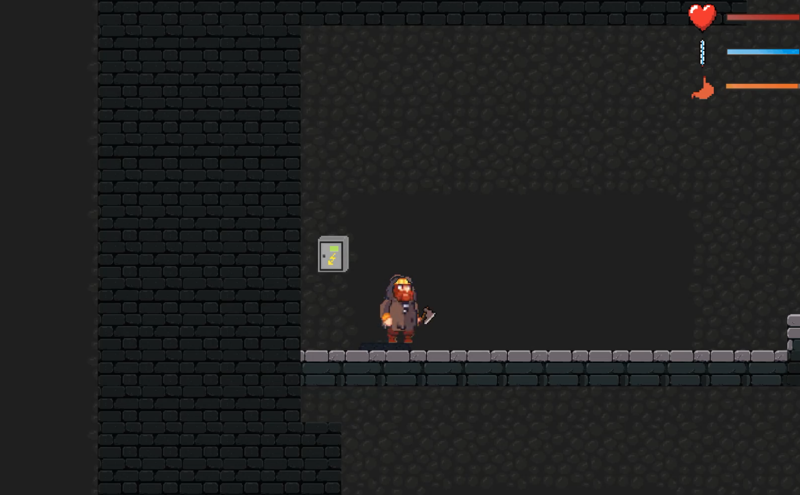
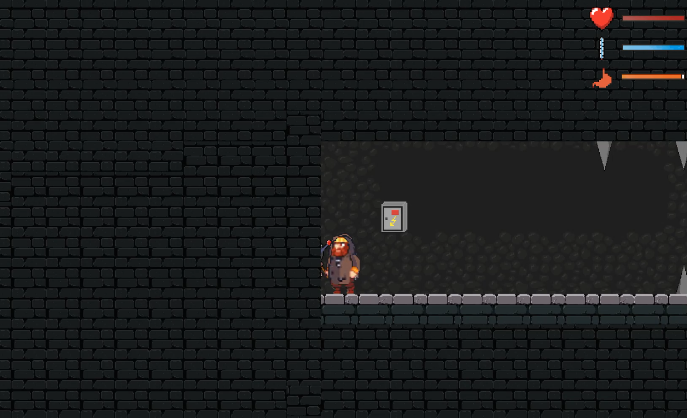
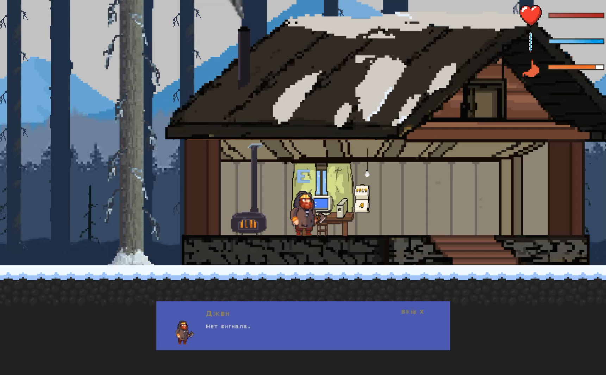

# Winter wood

___
В этом 2D платформере Вам предсоит играть за полярника, который отправился на поиски лета
___

## О проекте 

Проект является моим первым знакомством с Unity и С# 

### При разработке научился: 
+ Создавать 2D графику (Photoshop);
+ Работать с анимацией;
+ Познакомился c :     
  + particle system;
  + источниками света;
  + физикой в Unity (Collider, Physics Material, Rigidbody, Mesh, Joint);
  + audiomixer;
  + поработал с бинарной сериализацией данных;
  + научился создавать и использовать префабы; 
  + поработал с Raycast;
+ Создавать примитивный UI интерфейс;
+ Использовал паралакс эффект;
___

## Основной геймплей 

+ Cтандартное управление:
  + Перемещение(кнопки WASD, пробел)

+ Индикаторы состояния игрока: 
  + Здоровье:  
  Для пополнения индикатора необходимо подобрать аптечку;
   

  + Температура:  
  Чтобы согреться игроку необходимо развести костер, для этого потребуется срубить дерево. Если индикатор опускается до нуля, он начинает влиять на основное здоровье игрока;
  

  + Голод:  
 Для пополнения необходимо подобрть пищу, можно найти на уровне, либо уничтожить врага, из которого заспавнится необходимый предмет.Если индикатор опускается до нуля, он начинает влиять на основное здоровье игрока;
 
 

+ В игре присутствуют различные двери и платформы, для открытия которых необходимо взаимодействовать с кнопками и рычагами.

+ Система диалога.

___

## Что бы хотел изменить, если бы делал данный проект на сегодняшний день:

+ Создал бы атлас спрайтов 
+ Поменял архитектуру кода 
+ Так как проект является первым, внутри проекта было создано много мусора (лишние спрайты, скрипты) и беспорядок в архитектуре папок. 

 

